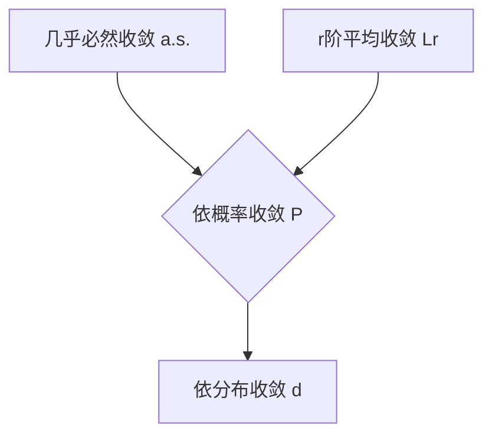

---
tags:
  - 概率论
  - 第四章
  - 理论方法
难度: 高级
前置知识:
  - "[[081-核心概念-几乎必然收敛]]"
  - "[[082-核心概念-r阶平均收敛]]"
  - "[[080-核心概念-依概率收敛]]"
  - "[[083-核心概念-依分布收敛(弱收敛)]]"
---

# 知识点概述
在概率论中，描述随机变量序列收敛的方式有多种，主要包括几乎必然收敛、r阶平均收敛、依概率收敛和依分布收敛。这些收敛模式的强度不同，理解它们之间的逻辑蕴含关系对于深刻掌握概率论中的极限定理至关重要。

# 教材原文
*(教材在4.1节标题“随机变量列的收敛性”下，通过并列介绍这几种收敛方式，隐含了对它们关系的探讨。)*

# 详细解释

### 1. 收敛强度关系图

这几种收敛方式的强度关系可以总结为下图：

*   **最强的收敛**: [[081-核心概念-几乎必然收敛|几乎必然收敛]] ($X_n \xrightarrow{a.s.} X$) 是非常强的收敛模式，它要求几乎每一个样本路径都收敛。
*   **中间层收敛**: [[082-核心概念-r阶平均收敛|r阶平均收敛]] ($X_n \xrightarrow{L^r} X$) 和 [[080-核心概念-依概率收敛|依概率收敛]] ($X_n \xrightarrow{P} X$) 处于中间层次。
*   **最弱的收敛**: [[083-核心概念-依分布收敛(弱收敛)|依分布收敛]] ($X_n \xrightarrow{d} X$) 是最弱的收敛模式，只要求分布函数收敛。

### 2. 主要蕴含关系详解

1.  **几乎必然收敛 $\implies$ 依概率收敛**
    *   **含义**: 如果一个序列几乎必然收敛，那么它一定依概率收敛。
    *   **直观理解**: 如果几乎所有的“样本路径”最终都收敛并停留在极限值附近，那么在任意一个大的时间点 $n$，随机变量 $X_n$ 的取值与极限值差别很大的概率自然也就趋向于0了。
    *   **反之不成立**: 依概率收敛不能推出几乎必然收敛。一个序列可能在每个时间点都以很大概率接近极限，但总存在一些样本路径会时不时地“跳”出去，导致该路径本身不收敛。

2.  **r阶平均收敛 $\implies$ 依概率收敛**
    *   **含义**: 如果一个序列r阶平均收敛，那么它一定依概率收敛。
    *   **证明**: 该结论由马尔可夫不等式直接可得。
    *   **反之不成立**: 依概率收敛不能推出r阶平均收敛。即使偏差大的概率趋于0，但这个偏差本身可能非常大，导致偏差的r次方期望不趋于0。

3.  **依概率收敛 $\implies$ 依分布收敛**
    *   **含义**: 如果一个序列依概率收敛，那么它一定依分布收敛。
    *   **直观理解**: 如果一个随机变量的值都向一个极限值 $c$ 靠拢，那么它的分布函数也必然会趋向于一个在 $c$ 点跳跃的阶梯函数（即退化分布）。
    *   **反之不成立**: 依分布收敛不能推出依概率收敛。依分布收敛只关心分布的形状，而依概率收敛关心的是值本身。一个序列的分布可以保持不变（因此依分布收敛），但其值可以持续波动，不收敛于任何特定值。

### 3. 特殊情况下的逆向关系

在某些特殊条件下，较弱的收敛可以推出较强的收敛。

*   **依概率收敛 $\implies$ 几乎必然收敛**: 如果 $X_n$ 依概率收敛于 $X$，并且收敛的速度“足够快”，即满足 $\sum_{n=1}^{\infty} P(|X_n - X| > \epsilon) < \infty$，那么可以推出 $X_n$ 几乎必然收敛于 $X$。（Borel-Cantelli引理的应用）

*   **依分布收敛 $\implies$ 依概率收敛**: 如果 $X_n$ 依分布收敛到一个**常数** $c$，即 $F_n(x) \to F_c(x)$（$F_c(x)$ 是在c点从0跳到1的阶梯函数），那么可以推出 $X_n$ **依概率收敛**于常数 $c$。
    $$X_n \xrightarrow{d} c \iff X_n \xrightarrow{P} c$$

# 学习要点
*   **记住强度顺序**: a.s. > $L^r$ > P > d。 （注：a.s. 和 $L^r$ 之间没有必然的蕴含关系，但在很多情况下，a.s.被认为是最强的）。
*   **掌握每个蕴含关系的证明思路或反例**: 理解为什么强的可以推到弱的，以及为什么弱的不能推到强的，是深刻理解这些概念的关键。
*   **关注特殊条件**: 了解在什么特殊情况下，逆向的蕴含关系可以成立（例如，收敛到常数）。

# 关联知识点
*   **前置知识**:
    *   [[081-核心概念-几乎必然收敛]]
    *   [[082-核心概念-r阶平均收敛]]
    *   [[080-核心概念-依概率收敛]]
    *   [[083-核心概念-依分布收敛(弱收敛)]]
*   **后续知识**:
    *   [[086-核心概念-大数定律的定义]] (强大数定律对应几乎必然收敛，弱大数定律对应依概率收敛)
    *   [[091-核心概念-中心极限定理的定义]] (中心极限定理是依分布收敛的典型例子)
