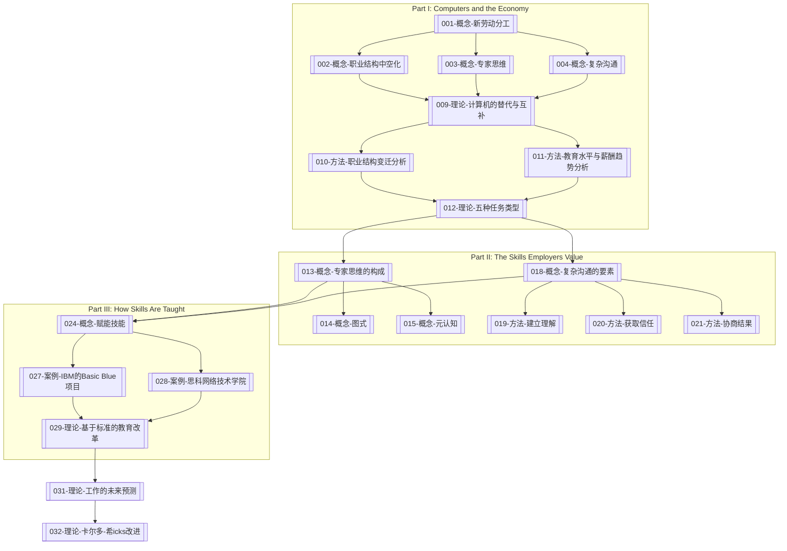

# 前置知识图谱

```mermaid
graph TD
    subgraph Part1[Part I: Computers and the Economy]
        A1[[001-概念-新劳动分工]] --> A2[[002-概念-职业结构中空化]];
        A1 --> A3[[003-概念-专家思维]];
        A1 --> A4[[004-概念-复杂沟通]];
        A2 --> A5[[009-理论-计算机的替代与互补]];
        A3 --> A5;
        A4 --> A5;
        A5 --> A6[[010-方法-职业结构变迁分析]];
        A5 --> A7[[011-方法-教育水平与薪酬趋势分析]];
        A6 --> A8[[012-理论-五种任务类型]];
        A7 --> A8;
    end

    subgraph Part2[Part II: The Skills Employers Value]
        B1[[013-概念-专家思维的构成]] --> B2[[014-概念-图式]];
        B1 --> B3[[015-概念-元认知]];
        B4[[018-概念-复杂沟通的要素]] --> B5[[019-方法-建立理解]];
        B4 --> B6[[020-方法-获取信任]];
        B4 --> B7[[021-方法-协商结果]];
    end

    subgraph Part3[Part III: How Skills Are Taught]
        C1[[024-概念-赋能技能]] --> C2[[027-案例-IBM的Basic Blue项目]];
        C1 --> C3[[028-案例-思科网络技术学院]];
        C2 --> C4[[029-理论-基于标准的教育改革]];
        C3 --> C4;
    end

    A8 --> B1;
    A8 --> B4;
    B1 --> C1;
    B4 --> C1;
    C4 --> D1[[031-理论-工作的未来预测]];
    D1 --> D2[[032-理论-卡尔多-希icks改进]];

```
